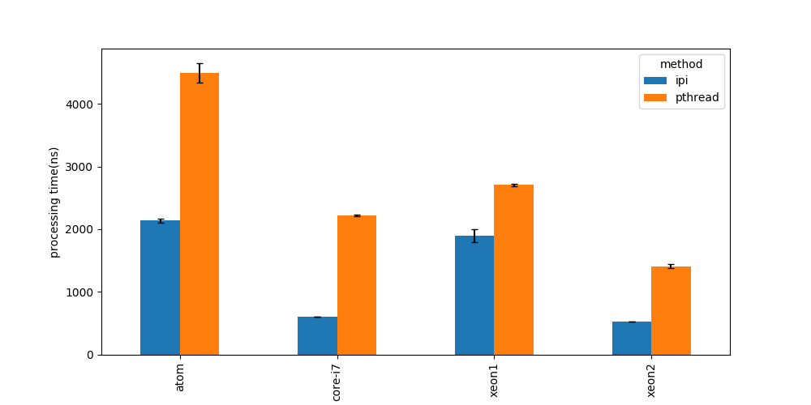

# Software Design 5月号 低レイヤー特集 ベアメタルプログラミングパート サンプルコード

## 各サンプルについて
全てのサンプルは、各々のディレクトリ内で`make`とする事で実行できます。ベアメタルコードについては、QEMU上で実行が可能です。

※ 6月号（後編）のコードは公開しておりません。ご了承ください。

make時に内部でdockerが走ります。最新版のdockerがinstallされており、実行できる（環境によってはsudoが必要かもしれません）必要があります。

## 記事中の誤りのお詫びと訂正
記事内に何点か誤りがありました。謹んでお詫び申し上げます。

誤りは以下の通りです。

### p.76 図5
縦軸の目盛が図4の物となっており、それぞれ1/10倍されています。

オリジナルの図は以下の通りです。

### p.76 図4,5
凡例の表記が統一されていません。

### p.77
誤：一番周波数の高いxeon2が最も遅いのは一見おかしなようにも見えますが、
正：一番周波数の高いxeon1が最も遅いのは一見おかしなようにも見えますが、